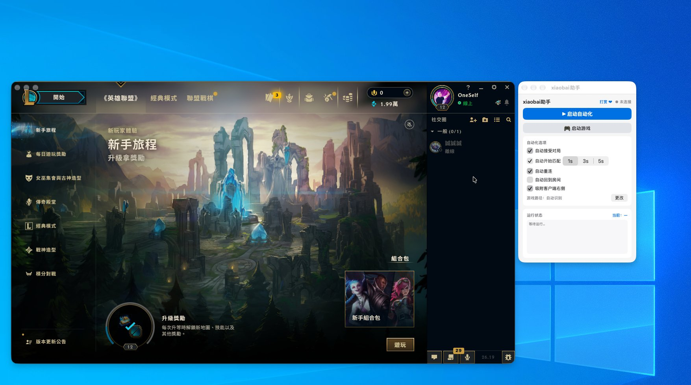
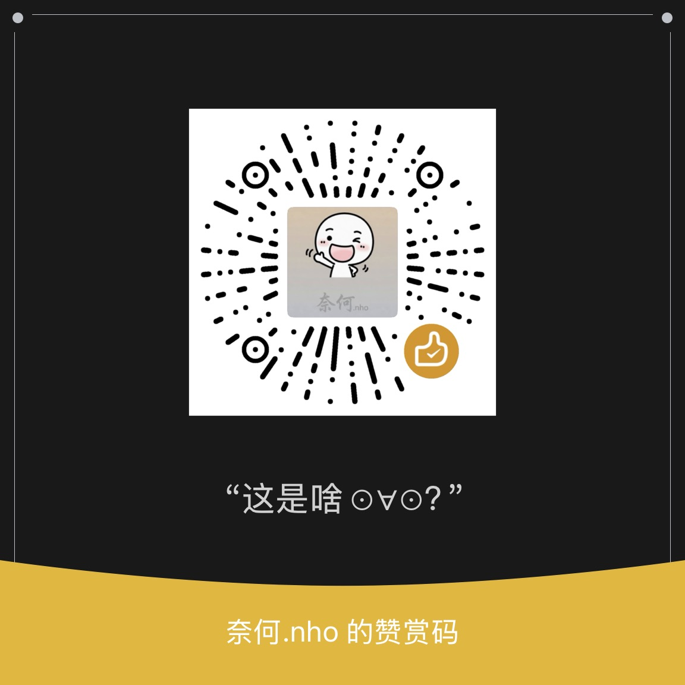

# xiaobai助手 · Mac 版

Windows 版（[lixyd/xiaobai-helper](https://github.com/lixyd/xiaobai-helper)）的 macOS 原生移植 —— **Swift + SwiftUI，无 Python 依赖，双击即用**。

专注 **极地大乱斗 / 海克斯大乱斗**。纯官方 LCU 本地 API —— **无进程注入 / 无内存读写 / 无键鼠模拟**。



## 功能

### 匹配自动化
- **`▶ 启动自动化`**：总开关，0.5s 高频轮询 LCU
- **自动接受对局**：ReadyCheck 盯守模式，按可选延迟（1s / 3s / 5s）自动接受，接受后复查确认，失败自动重试
- **自动开始匹配**：在房间时检测队列状态（5s 节流），未排队自动开始
- **自动重连**：掉线（Reconnect 阶段）自动连回对局
- **自动回到房间**：结算后自动点「再次游戏」（默认关闭）

### 一键启动游戏
- **`🎮 启动游戏`**：优先使用手动指定的路径，否则自动识别
  （`/Applications/League of Legends.app` → `~/Applications` → Riot Client.app）
- **游戏路径可自定义**：设置里「更改」手动选择客户端（选 .app 包），持久化保存，
  「默认」一键恢复自动识别 —— 装在非标准位置也没问题

### 窗口吸附
- **吸附客户端右侧**：无论客户端窗口在哪，助手自动贴到它右边（右侧放不下自动换左侧），顶部对齐
- 客户端移动/缩放时实时跟随；可在设置里关闭
- 纯读取窗口位置信息实现，**不需要任何系统权限**

### 其他
- Apple 风格浅色 UI（`#F5F5F7` + 白卡片 + `#0071E3`），锁定窗口 300×430，不遮挡游戏
- **打赏 ❤**：内置微信打赏码
- 窗口图标 = Windows 版同款 logo

## 下载 / 构建

```zsh
git clone https://github.com/lixyd/xiaobai-helper-mac.git
cd xiaobai-helper-mac
./build.sh          # 产出 build/xiaobai助手.app（arm64，ad-hoc 签名）
```

构建脚本会同时把一份副本同步到 `~/Desktop/xiaobai助手.app`，双击即可运行；
启动后窗口自动居中并置前。

要求：macOS 13+，Xcode Command Line Tools（`xcode-select --install`）。

## 权限说明

- **无需辅助功能 / 输入监控** —— 全部操作走 LCU 官方本地 API（`https://127.0.0.1:<port>`）
- lockfile 自动发现；本机构建的应用无隔离属性，直接双击运行；
  若从别处拷贝被 Gatekeeper 拦截，在「系统设置 → 隐私与安全性」点「仍要打开」

## 路线

- [x] 匹配自动化（接受 / 开始 / 重连 / 回到房间）
- [x] 一键启动游戏（自动识别 + 手动指定）
- [x] 窗口吸附客户端右侧
- [ ] 备战席抢英雄
- [ ] 海克斯图鉴
- [ ] 菜单栏常驻模式

## 打赏

如果帮到了你，可以请作者喝杯奶茶 ☕

<p align="center">
  
</p>

## License

MIT
